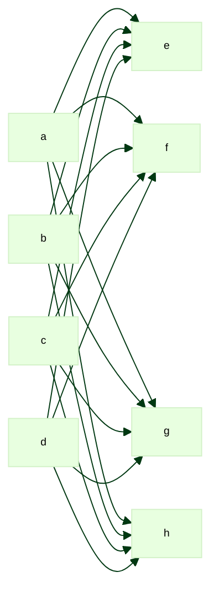

# `test_graphs.md`

Mermaid has a configurable limit for the maximum allowed number of edges on a
graph. The purpose of this file is to allow probing of roughly what that limit
is in any given context.

In my Markdown preview in VS Code on Windows, that limit falls somewhere between
256 and 269 edges.

On GitHub, that limit is somewhere between ..........?

### 16 edges

### 256 edges

### 269 edges

